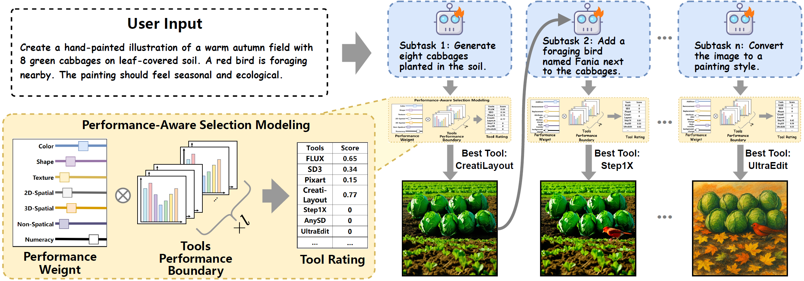

<h1 align="center">PerfGuard of ICLR2026</h1>

This is the official code for PerfGuard in ICLR 2026




## Environment Setup
1. Install Conda Environment
```shell
conda create -n PerfGuard python=3.10
conda activate PerfGuard
```

2. Install [MetaGPT](https://github.com/FoundationAgents/MetaGPT)

3. Please go to the following GitHub repository to install the necessary tool dependencies.
```shell
https://github.com/HaozheZhao/UltraEdit
https://github.com/HuiZhang0812/CreatiLayout
https://github.com/stepfun-ai/Step1X-Edit
https://github.com/weichow23/AnySD
https://github.com/bytedance/DreamO
https://github.com/Xiaojiu-z/EasyControl
https://github.com/tencent-ailab/IP-Adapter
```

4. Modify the relevant code to avoid environment conflicts.
```shell
# Insert the following code into './Step1X_Edit/inference.py'
import sys
sys.path.append("Step1X_Edit")
# Insert the following code into  './AnySD/anysd/src/model.py'
import sys
sys.path.append("AnySD")
```

5. Install the remaining dependencies
```shell
pip install -r requirement.txt
```

6. Download the planner checkpoint zip file and unzip it.
```shell
link: https://pan.baidu.com/s/1DyK9rZeTebdwAKfl_pl6DQ?pwd=ziy2 passward: ziy2 
```

7. Deploy LLM locally using vLLM
```shell
export VLLM_USE_MODELSCOPE=True 
vllm serve Qwen/Qwen3-14B   --port 8001
vllm serve your_planner_checkpoint  --port 8002
```

8. Modify the LLM config file under `./config`

## Run the program
```shell
python run.py
```

